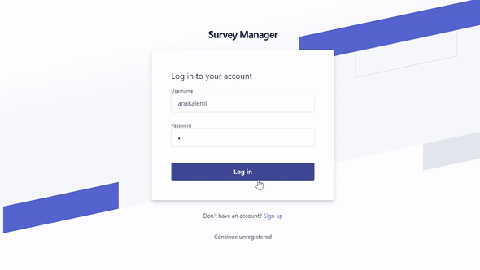
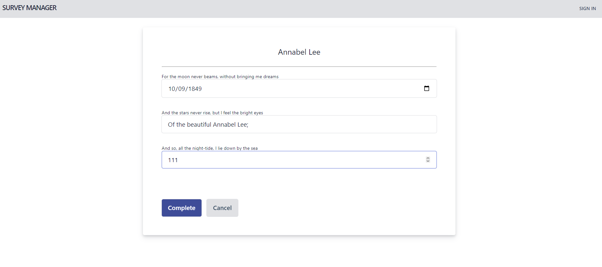

# SurveyManager

SurveyManager is a web-based platform designed for seamless survey management. This system offers a comprehensive
solution tailored for both system administrators and end-users, encompassing survey creation and participation.

## Technologies

- **Frontend:** HTML5, CSS, JavaScript

- **Backend:** PHP

- **Database:** MySQL

## Design Patterns

### MVC (Model-View-Controller):

It is object-oriented and built using the *MVC pattern* to logically structure the code on components that are
built to handle specific development aspects of the application. This trusted design pattern segments application logic:

- **Model:** Handles all data-related logic.

- **View:** Presents a clean and interactive UI.

- **Controller:** Processes user commands.

### DAO (Data Access Object):

Another pattern used is *DAO* which is a pattern that provides an abstract interface to the database. By mapping
application calls to the persistence layer, DAO provides specific data operations without exposing details of the
database. This pattern offers abstraction and encapsulation.

## Features

### System Users:

- **Survey Creation:** Users can design comprehensive surveys, incorporating diverse question types and structures.

- **Survey Maintenance:** Allows for updates, edits, or removal of existing surveys.

- **Survey Publication:** Facilitates easy sharing of surveys across users.

- **Analytics Dashboard:** Visualize survey results in real-time.

### Unregistered Users:

- **Anonymous Participation:** Users can fill out surveys without needing an account or revealing their identity.

- **Interactive Interface:** Dynamic forms adjust based on user inputs, providing a responsive survey experience.

## Configuration & Setup

To get the project up and running, follow these steps:

1. **XAMPP:** This project uses XAMPP as a tool for MySQL and Apache. Ensure you have it installed.

2. **Database Setup:** Run the provided [SQL script](database/sqlDump.sql) to populate the MySQL database.

3. **Server Configuration:** Start both the MySQL and Apache servers using XAMPP to host the project locally.

## Testing

Explore SurveyManager:

- [Sign in](http://localhost/SurveyManagerV2/view/Signin.php) with the test account.

- New? Try the [Sign Up](http://localhost/SurveyManagerV2/view/Signup.php) process.

**Test Account:**

- **Username:** anakalemi
- **Password:** 1

## Preview

---